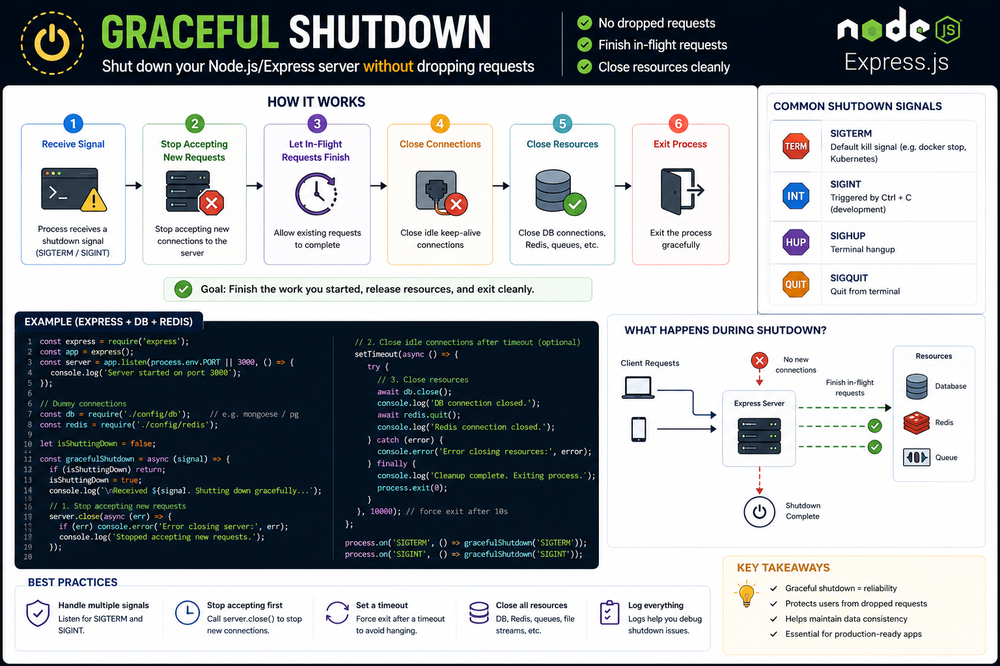

Pulling the plug on your server isn't the same as shutting it down correctly. ⚠️

In production, your app should support **Graceful Shutdown**.

Instead of killing the process immediately, it should:

🛑 Stop accepting new requests
⏳ Finish in-flight requests
🔌 Close database & Redis connections
🧹 Release resources
👋 Exit cleanly

Typical flow:

```text id="w9r8na"
SIGTERM/SIGINT
      ↓
server.close()
      ↓
Finish active requests
      ↓
Close DB / Redis
      ↓
process.exit(0)
```

Why it matters:

✅ Prevents dropped requests
💾 Avoids data corruption or partial writes
🚀 Makes deployments and restarts safer
☸️ Essential for Docker, Kubernetes, and cloud environments

💡 Always listen for `SIGTERM` and `SIGINT`. A graceful shutdown is one of those production-ready practices that users never notice—but they'll definitely notice when it's missing.

Does your Node.js app handle graceful shutdown yet? 👇

#NodeJS #ExpressJS #Backend #JavaScript #DevOps #Docker #Kubernetes #WebDevelopment #Programming


