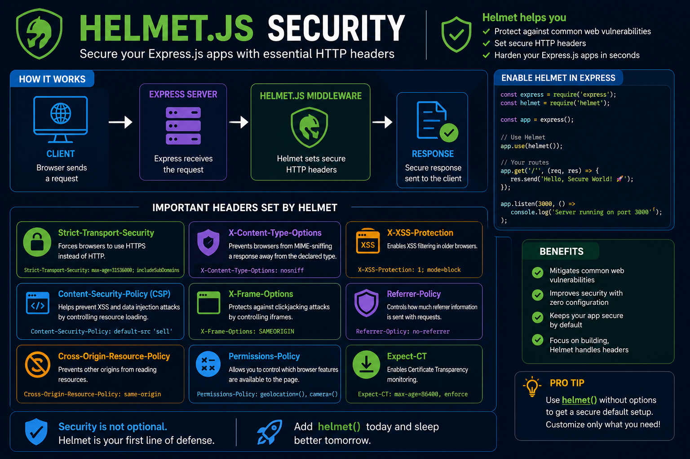

One line of code can make your Express.js app much harder to attack. 🛡️

Meet **Helmet.js**.

It's a middleware that secures your app by setting important HTTP security headers automatically.

```js
app.use(helmet());
```

Out of the box, Helmet helps by:

🔒 Preventing clickjacking attacks
🚫 Reducing MIME-type sniffing
🛡️ Enforcing a strong Content Security Policy (when configured)
🔐 Improving browser security with secure HTTP headers

Why use it?

✅ Better security with minimal effort
✅ Helps mitigate common web vulnerabilities
✅ Production-ready with sensible defaults

💡 Helmet isn't a complete security solution—but it's one of the easiest and most effective first steps to harden any Express.js application.

Do you enable `helmet()` in every new Express project? 👇

#ExpressJS #NodeJS #Backend #JavaScript #CyberSecurity #HelmetJS #WebDevelopment #Programming #Coding


