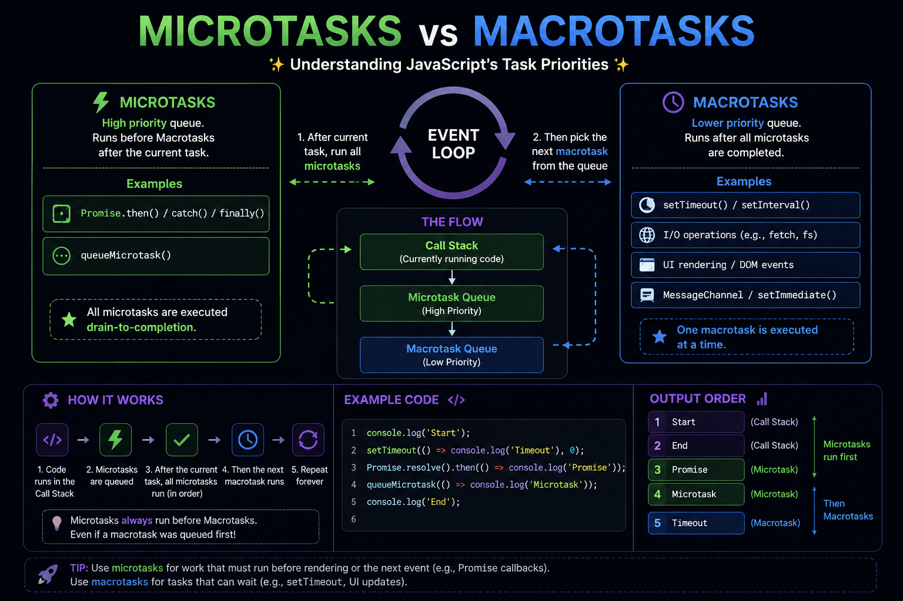

⚡ **One of the most misunderstood JavaScript concepts: Microtasks vs Macrotasks.**

Both are asynchronous, but **they don't have the same priority.**

🟢 **Microtasks**
• `Promise.then()`
• `catch()`
• `finally()`
• `queueMicrotask()`

🔵 **Macrotasks**
• `setTimeout()`
• `setInterval()`
• DOM Events
• I/O callbacks

The Event Loop always follows this order:

1️⃣ Run synchronous code
2️⃣ Execute **ALL Microtasks**
3️⃣ Execute **ONE Macrotask**
4️⃣ Repeat

Example:

```js
console.log("Start");

setTimeout(() => console.log("Timeout"), 0);

Promise.resolve().then(() => console.log("Promise"));

console.log("End");
```

Output:

```
Start
End
Promise
Timeout
```

💡 Even with `setTimeout(..., 0)`, **Promises always run first** because the Microtask Queue has higher priority.

Master this, and asynchronous JavaScript will finally make sense.

#JavaScript #WebDevelopment #Frontend #NodeJS #AsyncProgramming #Coding


