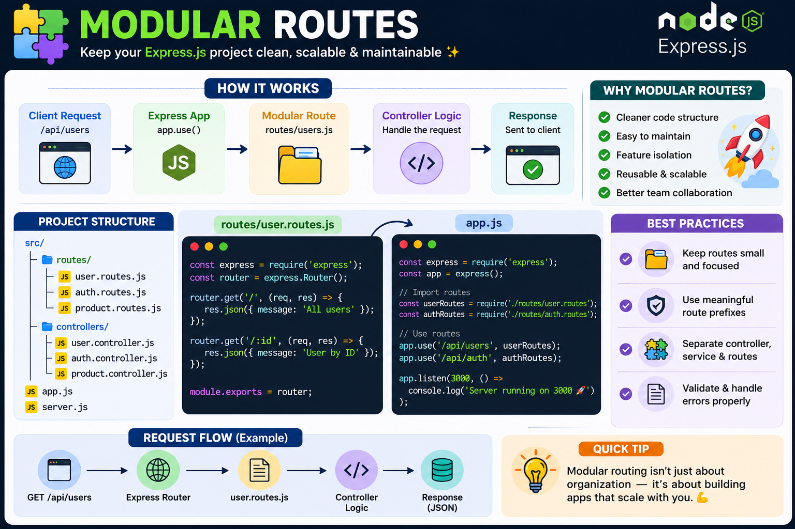

If your entire Express.js API lives in `app.js`, it's only a matter of time before it becomes unmanageable. 🤯

The solution? **Modular Routes.**

Instead of one giant file, organize routes by feature.

```js id="b2x7kq"
app.use('/users', userRoutes);
app.use('/products', productRoutes);
app.use('/orders', orderRoutes);
```

Each route file handles a single responsibility:

📂 `routes/users.js`
📂 `routes/products.js`
📂 `routes/orders.js`

Why it matters:

✅ Cleaner project structure
🚀 Easier to scale as your API grows
👥 Better collaboration in teams
🔄 Reusable and maintainable code

💡 Take it a step further: keep your **routes**, **controllers**, **services**, and **middlewares** in separate folders. A clean architecture today saves hours of debugging tomorrow.

Small files. Big projects. Better code. 💪

How do you organize your Express.js projects—by feature or by file type? 👇

#ExpressJS #NodeJS #Backend #JavaScript #WebDevelopment #SoftwareArchitecture #Programming #Coding #CleanCode


