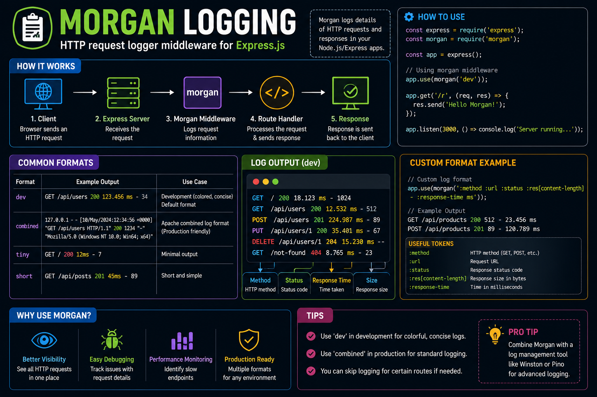

When an API fails, the first question is usually:

**"What request caused it?"** 🤔

That's why **Morgan** is one of the first middleware I add to every Express.js project.

With a single line:

```js id="2y1xqm"
app.use(morgan('dev'));
```

you get request logs like:

✅ HTTP method (`GET`, `POST`)
✅ URL (`/api/users`)
✅ Status code (`200`, `404`, `500`)
✅ Response time
✅ Response size

Why it matters:

🔍 Makes debugging much easier
📊 Helps spot slow endpoints
🚨 Quickly identifies failed requests
⚡ Gives instant visibility into API traffic

💡 Morgan is perfect for request logging, but for production applications, pair it with a logger like **Winston** or **Pino** for structured logs and long-term monitoring.

Good logs don't just help you fix bugs—they help you find them before your users do. 🚀

#ExpressJS #NodeJS #Backend #JavaScript #Logging #Morgan #WebDevelopment #Programming #Coding


