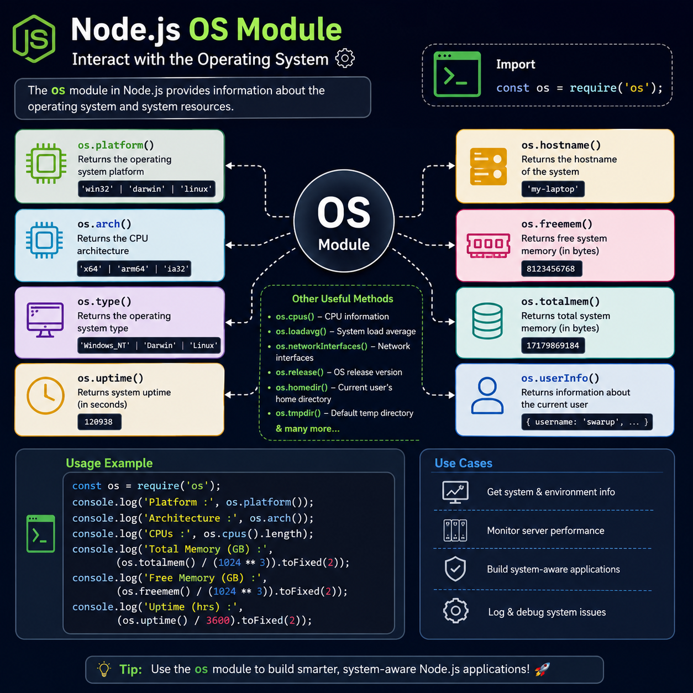

Most developers use the Node.js `os` module only to check the platform—but it offers much more.

With a few built-in methods, you can inspect your system without installing any external package:

🖥️ `os.platform()` → Operating system
⚙️ `os.arch()` → CPU architecture
💾 `os.totalmem()` & `os.freemem()` → Memory usage
⏱️ `os.uptime()` → System uptime
👤 `os.userInfo()` → Current user details
🧠 `os.cpus()` → CPU information

Perfect for:
✅ System monitoring
✅ Performance diagnostics
✅ Environment-aware applications
✅ Debugging deployment issues

Small module. Big insights. 🚀

Which `os` method do you use the most in your Node.js projects?

#NodeJS #JavaScript #Backend #WebDevelopment #100DaysOfCode #Programming #Coding

