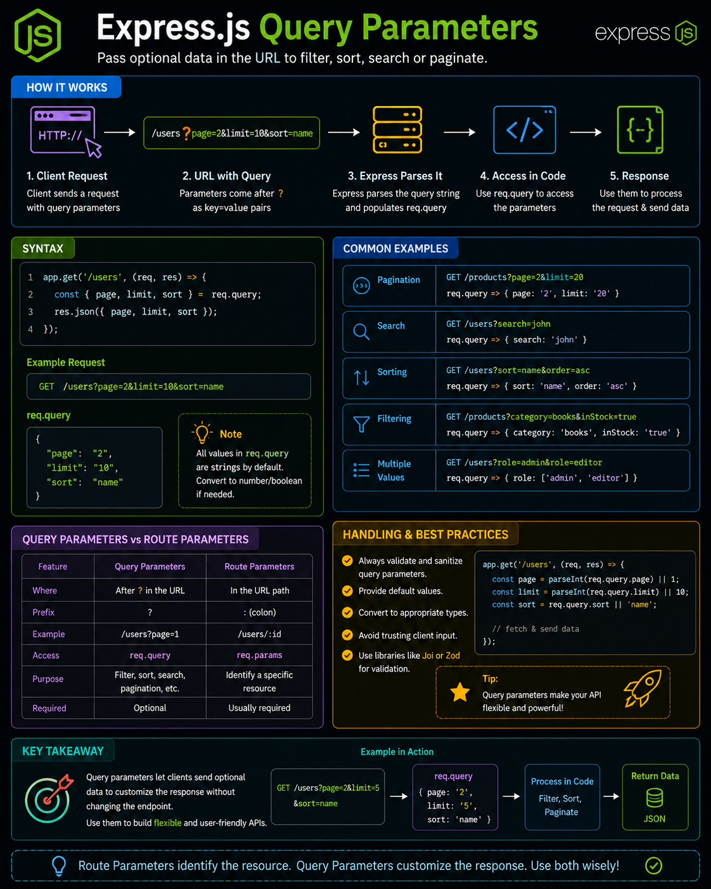

Need filtering, sorting, or pagination in your API? That's exactly what **Query Parameters** are for. 🚀

Unlike route parameters, query parameters are **optional** and come after the `?` in the URL.

Example:

```js id="4kz7dt"
app.get('/products', (req, res) => {
  const { page, limit, sort } = req.query;
});
```

Request:

```text id="8xq3mr"
GET /products?page=2&limit=10&sort=price
```

Perfect for:
🔍 Search → `?search=laptop`
📄 Pagination → `?page=2&limit=10`
↕️ Sorting → `?sort=price`
🎯 Filtering → `?category=electronics`

💡 Rule of thumb:

* `req.params` → **Which resource?**
* `req.query` → **How should the results be returned?**

Mastering both helps you build clean, flexible, and RESTful APIs.

What's the most common query parameter you use in your projects? 👇

#ExpressJS #NodeJS #Backend #JavaScript #RESTAPI #WebDevelopment #Programming #Coding


