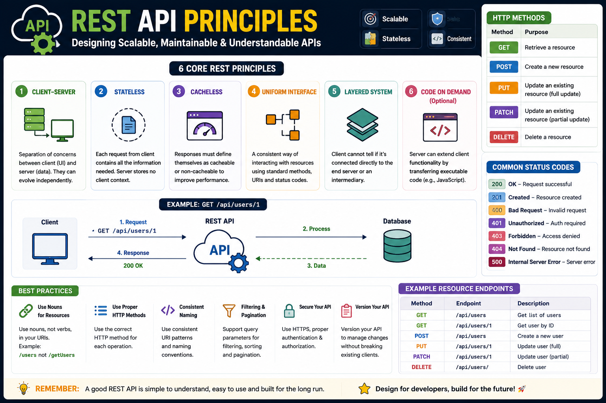

A REST API isn't just a collection of endpoints—it's a set of design principles that make your API predictable, scalable, and easy to use. 🚀

The fundamentals:

🌐 Use **resources**, not actions (`/users`, not `/getUsers`)
📌 Use the correct HTTP methods (`GET`, `POST`, `PUT`, `PATCH`, `DELETE`)
📦 Keep requests **stateless**—every request contains everything the server needs
📄 Return meaningful HTTP status codes (`200`, `201`, `404`, `500`)
📑 Design consistent URLs and response formats

Example:

```text id="u8q5wx"
GET    /users
POST   /users
GET    /users/1
PUT    /users/1
DELETE /users/1
```

💡 Great REST APIs are intuitive. If another developer can guess your endpoint before reading the docs, you've probably designed it well.

Good API design isn't about adding more endpoints—it's about making every endpoint predictable.

What's the biggest REST API design mistake you've seen in production? 👇

#RESTAPI #NodeJS #ExpressJS #Backend #JavaScript #API #WebDevelopment #Programming #SoftwareEngineering


