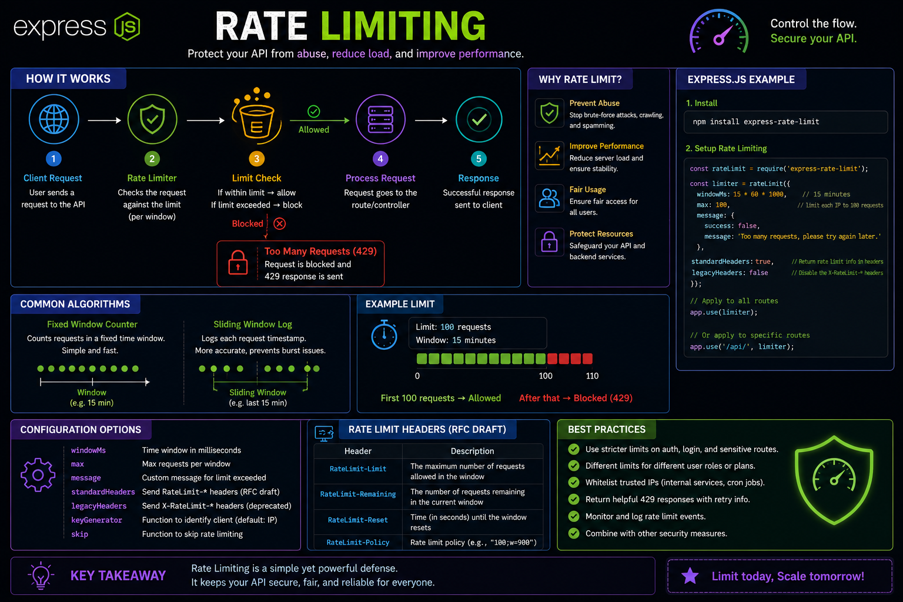

Your API shouldn't let one user consume all your server resources. 🚦

That's where **Rate Limiting** comes in.

It limits how many requests a client can make within a specific time window.

Example:
✅ 100 requests / 15 minutes → Allowed
❌ 101st request → `429 Too Many Requests`

Why it matters:
🛡️ Prevents brute-force attacks
🚫 Stops API abuse and spam
⚡ Reduces server load
⚖️ Ensures fair usage for everyone

With Express.js, it's as simple as adding middleware like `express-rate-limit` to protect your routes.

💡 Rate limiting isn't just about blocking users—it's about keeping your API secure, stable, and available under heavy traffic.

Do you apply rate limiting globally or only on sensitive routes like login and authentication? 👇

#ExpressJS #NodeJS #Backend #JavaScript #API #WebDevelopment #CyberSecurity #Programming #Coding

