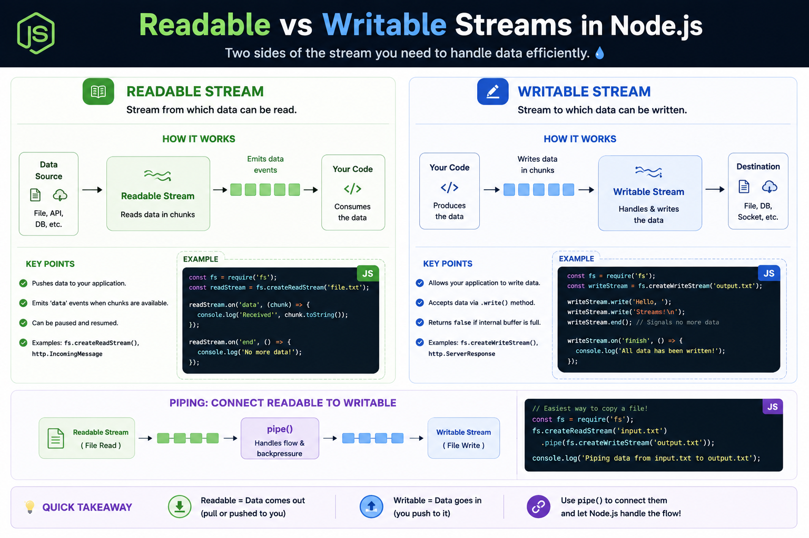

💧 **Every Node.js stream has one job: either read data or write it.**

Understanding the difference makes working with files, APIs, and sockets much easier.

📖 **Readable Stream**
• Reads data from a source
• Delivers data in chunks
• Examples: `fs.createReadStream()`, HTTP requests

✍️ **Writable Stream**
• Receives and writes data
• Accepts chunks via `.write()`
• Examples: `fs.createWriteStream()`, HTTP responses

The real magic happens when you combine them:

```js id="q8w2nx"
fs.createReadStream("input.txt")
  .pipe(fs.createWriteStream("output.txt"));
```

✨ `pipe()` connects a Readable Stream to a Writable Stream and automatically manages the data flow.

💡 Think of it like this:
📖 Readable = Data comes **out**
✍️ Writable = Data goes **in**

Master these two, and you're halfway to mastering Node.js Streams.

#NodeJS #JavaScript #Backend #WebDevelopment #Streams #Coding


