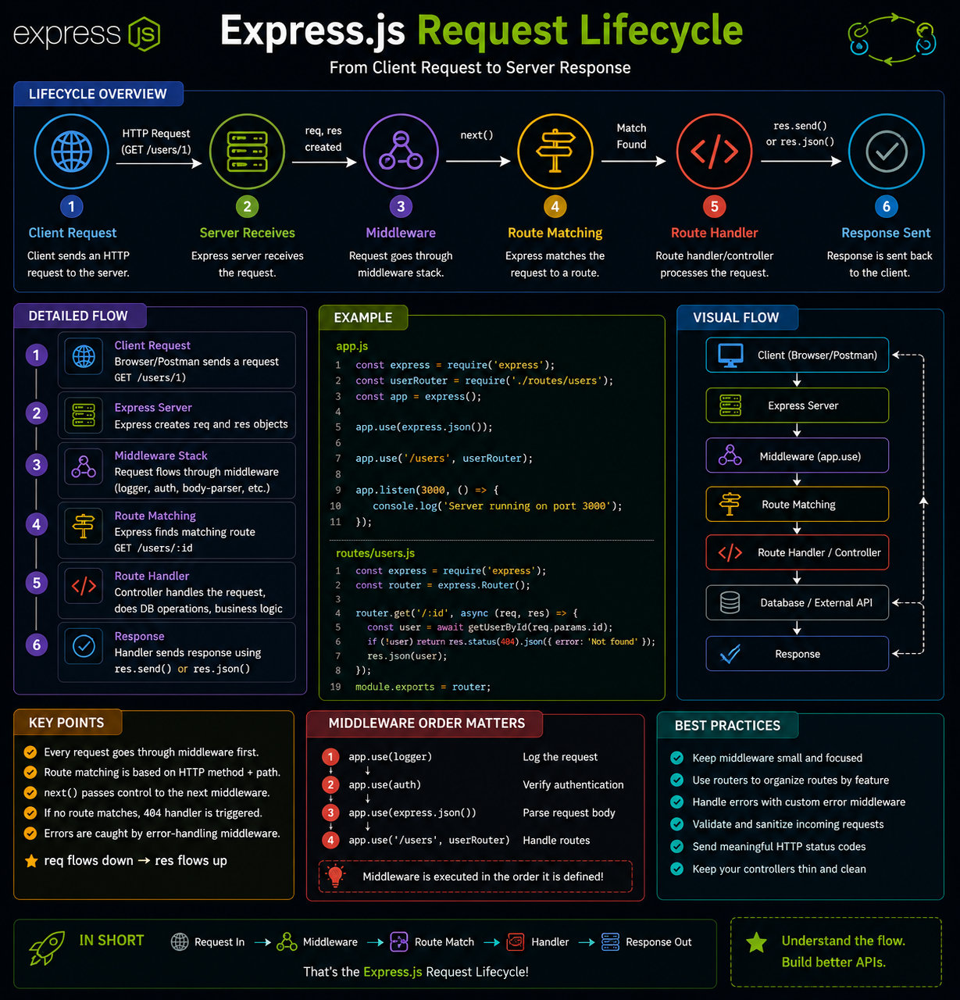

Every HTTP request in Express.js follows the same journey—and understanding it makes debugging much easier. 🚀

Here's the request lifecycle:

🌐 Client sends a request
⬇️
🛡️ Middleware processes it (logging, auth, validation)
⬇️
🧭 Express matches the route
⬇️
⚙️ Route handler/controller executes your business logic
⬇️
🗄️ Database or external API (if needed)
⬇️
📤 Response is sent back to the client

A few things to remember:
✅ Middleware runs in the order it's registered
✅ `next()` passes control to the next middleware
✅ If no route matches → **404**
✅ Errors flow to your error-handling middleware

💡 Master the request lifecycle, and you'll understand exactly where your code runs—and where bugs are hiding.

Which part of the lifecycle took you the longest to understand? 👇

#ExpressJS #NodeJS #Backend #JavaScript #WebDevelopment #RESTAPI #Programming #Coding

