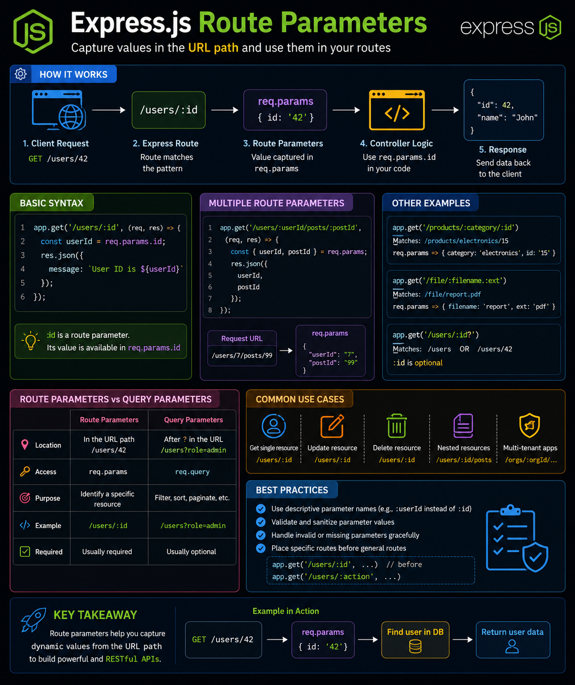

Want dynamic URLs in your Express.js API? **Route Parameters** are the answer. 🚀

Instead of creating separate routes, capture values directly from the URL.

Example:

```js
app.get('/users/:id', (req, res) => {
  console.log(req.params.id);
});
```

A request to:

```text
GET /users/42
```

gives you:

```js
req.params.id // "42"
```

Perfect for:
👤 `/users/:id`
📦 `/products/:productId`
📝 `/posts/:postId/comments/:commentId`

💡 **Route Parameters** identify a specific resource, while **Query Parameters** (`?page=2&sort=asc`) are used for filtering, sorting, and pagination.

Mastering this distinction is a key step toward building clean, RESTful APIs.

Do you prefer designing APIs with route parameters or query parameters? 👇

#ExpressJS #NodeJS #Backend #JavaScript #RESTAPI #WebDevelopment #Programming #Coding


