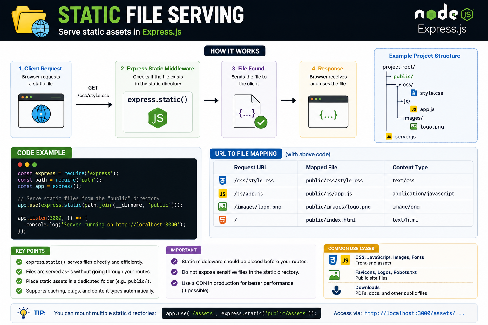

Not every request needs a controller. Sometimes, Express can serve files directly. 📁⚡

That's exactly what **`express.static()`** is for.

With one line:

```js id="bg8w2p"
app.use(express.static('public'));
```

Express can automatically serve:

🖼️ Images
🎨 CSS files
📜 JavaScript files
🔤 Fonts
📄 PDFs and other public assets

Example:

```
public/
├── css/style.css
├── js/app.js
└── images/logo.png
```

Now you can access:

🌐 `/css/style.css`
🌐 `/js/app.js`
🌐 `/images/logo.png`

💡 Keep only public assets in your static folder. Never expose sensitive files like environment variables, configuration files, or private uploads.

Simple setup. Faster responses. Less code. 🚀

Do you serve static assets directly from Express or use a CDN/reverse proxy in production? 👇

#ExpressJS #NodeJS #Backend #JavaScript #WebDevelopment #Performance #Programming #Coding #ExpressJS

