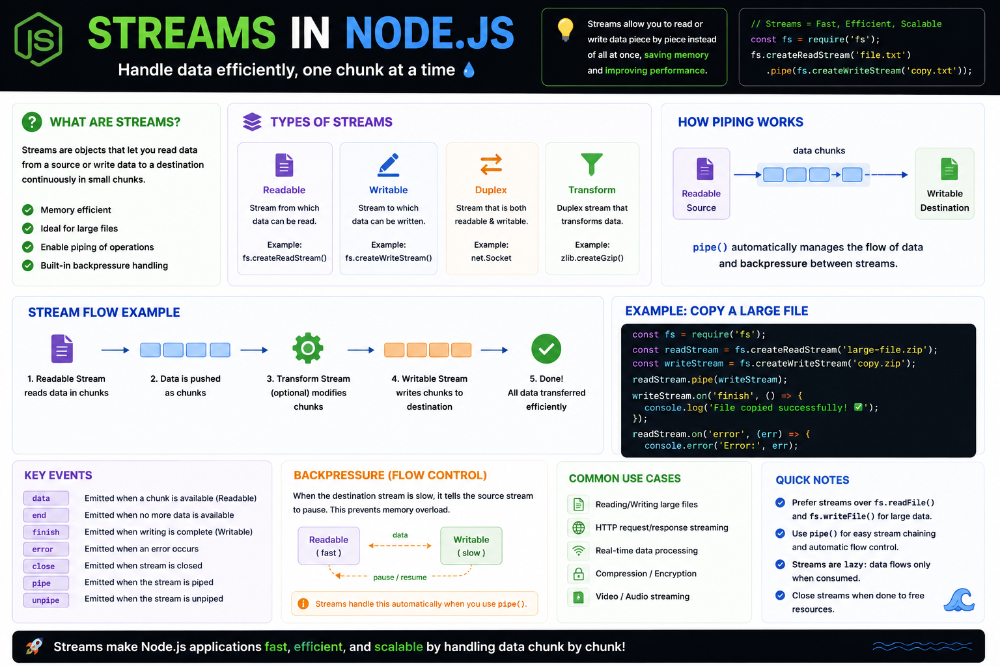

💧 **One of the biggest reasons Node.js is so fast? Streams.**

Instead of loading an entire file into memory, **Streams process data chunk by chunk**.

Why does that matter?

✅ Lower memory usage
✅ Faster processing
✅ Perfect for large files
✅ Built-in backpressure handling

There are **4 types of streams**:

📖 Readable → Read data
✍️ Writable → Write data
🔄 Duplex → Read & write
⚙️ Transform → Read, modify, and write

Example:

```js id="k7f3qz"
const fs = require("fs");

fs.createReadStream("input.txt")
  .pipe(fs.createWriteStream("output.txt"));
```

💡 Use Streams whenever you're working with large files, HTTP requests, file uploads, compression, or real-time data.

**Don't move gigabytes at once—stream them.** 🚀

#NodeJS #JavaScript #Backend #WebDevelopment #Performance #Coding #Streams


