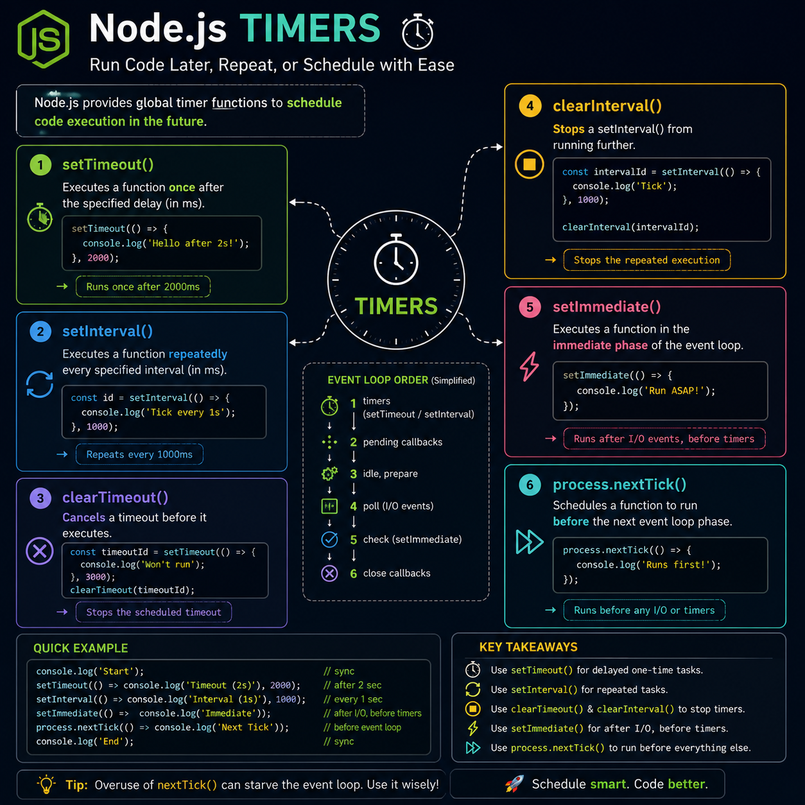

Mastering Node.js timers is more than just delaying code—it's about understanding how the event loop schedules work. ⏱️

Here's your quick cheat sheet:

⏰ `setTimeout()` → Run code once after a delay
🔄 `setInterval()` → Run code repeatedly at fixed intervals
❌ `clearTimeout()` → Cancel a scheduled timeout
🛑 `clearInterval()` → Stop a repeating interval
⚡ `setImmediate()` → Execute after the current I/O cycle
🚀 `process.nextTick()` → Run before the event loop continues

Knowing **when** each one executes helps you write more predictable, performant asynchronous code and avoid tricky bugs.

💡 Don't just memorize the APIs—understand *when* they run.

Which timer API has confused you the most: `setImmediate()` or `process.nextTick()`? 👇

#NodeJS #JavaScript #Backend #WebDevelopment #EventLoop #Programming #Coding

