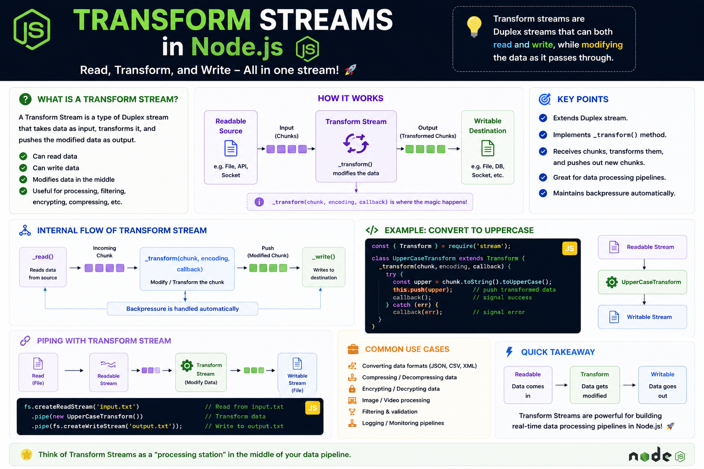

⚡ **Transform Streams are where the real magic happens in Node.js.**

Unlike Readable or Writable streams, a **Transform Stream** can:

📥 Read data
🛠️ Modify it on the fly
📤 Write the transformed data

It's a **Duplex Stream** that processes data **chunk by chunk**, making it perfect for efficient data pipelines.

Common use cases:

✅ Compressing files
✅ Encrypting/Decrypting data
✅ Parsing CSV or JSON
✅ Image processing
✅ Data validation & formatting

Example:

```js id="t9m4kx"
fs.createReadStream("input.txt")
  .pipe(new UpperCaseTransform())
  .pipe(fs.createWriteStream("output.txt"));
```

💡 Think of a Transform Stream as a **processing station** between the source and destination:

📖 Read → ⚙️ Transform → ✍️ Write

Process data as it flows—without loading everything into memory. 🚀

#NodeJS #JavaScript #Backend #WebDevelopment #Streams #Coding


