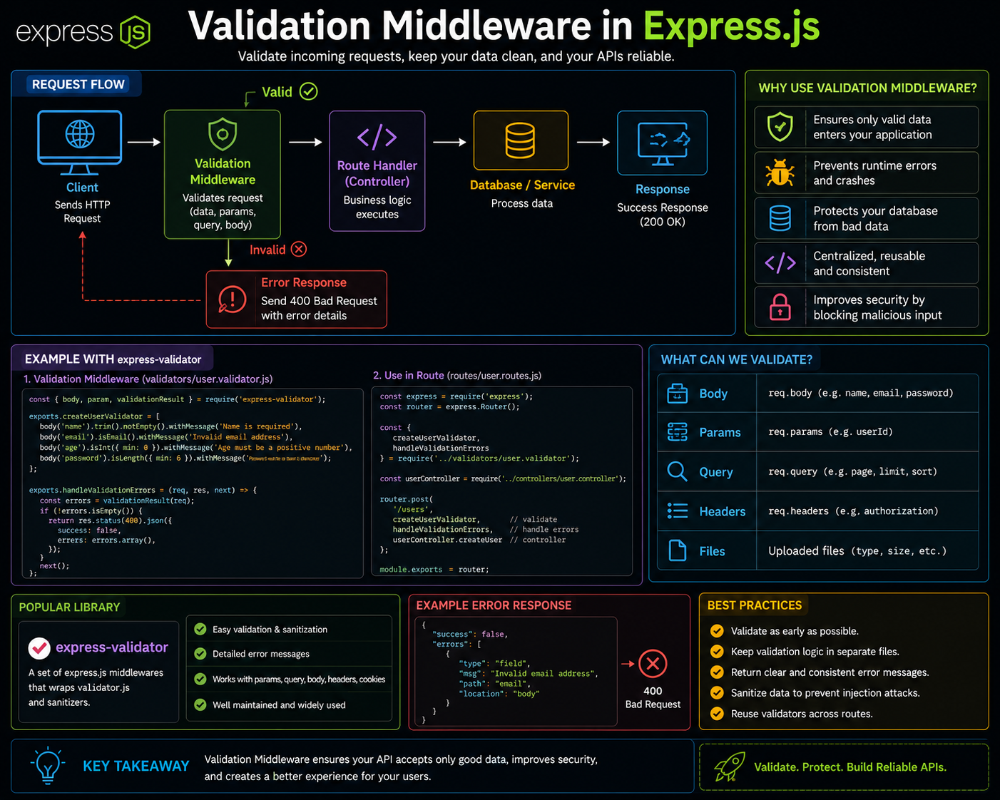

Your API is only as reliable as the data it accepts. 🛡️

That's why **Validation Middleware** should be one of the first things every request passes through.

Instead of validating inside every controller, validate **before** your business logic runs.

Typical flow:

🌐 Client Request
⬇️
✅ Validation Middleware
⬇️
⚙️ Controller
⬇️
🗄️ Database
⬇️
📤 Response

If validation fails:
❌ Return `400 Bad Request`
❌ Stop invalid data from reaching your database
❌ Send clear, consistent error messages

Popular tools:
✔️ Zod
✔️ Joi
✔️ express-validator

💡 Keep controllers focused on business logic and let validation middleware handle data quality.

Clean input = Secure APIs = Fewer bugs. 🚀

Which validation library do you prefer for Express.js—**Zod**, **Joi**, or **express-validator**? 👇

#ExpressJS #NodeJS #Backend #JavaScript #API #WebDevelopment #Programming #Coding #Validation

