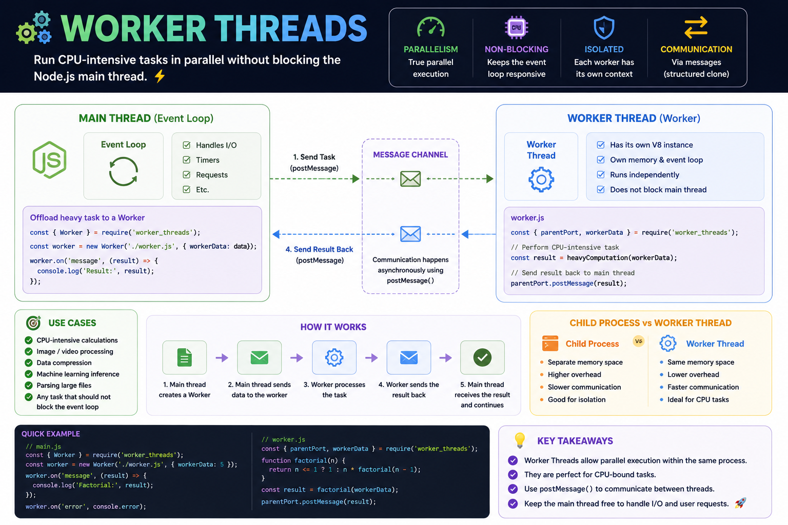

🚀 **Did you know Node.js can run JavaScript in parallel?**

Meet **Worker Threads**—the solution for CPU-intensive tasks that would otherwise block the Event Loop.

✅ Best use cases:
• Image & video processing
• Data compression
• Large file parsing
• Machine learning
• Heavy mathematical computations

How it works:

🧵 Main Thread → Creates a Worker
📩 Sends data to the Worker
⚙️ Worker processes the task independently
📤 Sends the result back via `postMessage()`
🔁 Main Thread stays responsive throughout

Unlike asynchronous I/O, **Worker Threads provide true parallel execution** for CPU-bound tasks.

💡 Rule of thumb:

* Use the **Event Loop** for I/O-bound work.
* Use **Worker Threads** for CPU-bound work.

Smarter architecture = Faster Node.js applications. ⚡

#NodeJS #JavaScript #Backend #WebDevelopment #Performance #Coding

