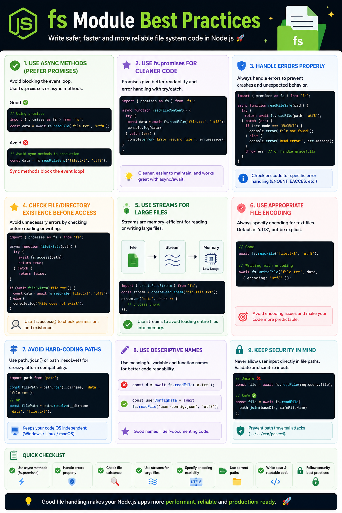

📁 **Using the `fs` module? Small habits can make a big difference.**

Follow these best practices to write faster, safer, and production-ready Node.js code:

✅ Prefer `fs/promises` with `async/await`
✅ Handle errors using `try...catch`
✅ Use **Streams** for large files instead of loading everything into memory
✅ Avoid hardcoded paths—use `path.join()` or `path.resolve()`
✅ Specify file encoding (`utf8`) explicitly
✅ Validate file paths to prevent path traversal attacks

Example:

```js id="n7x2ka"
import { readFile } from "fs/promises";

try {
  const data = await readFile("notes.txt", "utf8");
  console.log(data);
} catch (err) {
  console.error(err);
}
```

💡 **Rule of thumb:**

* 📄 Small files → `fs/promises`
* 🌊 Large files → Streams
* 🔒 User input → Always validate paths

Good file handling isn't just about reading files—it's about building reliable, scalable Node.js applications.

#NodeJS #JavaScript #Backend #WebDevelopment #BestPractices #Coding


