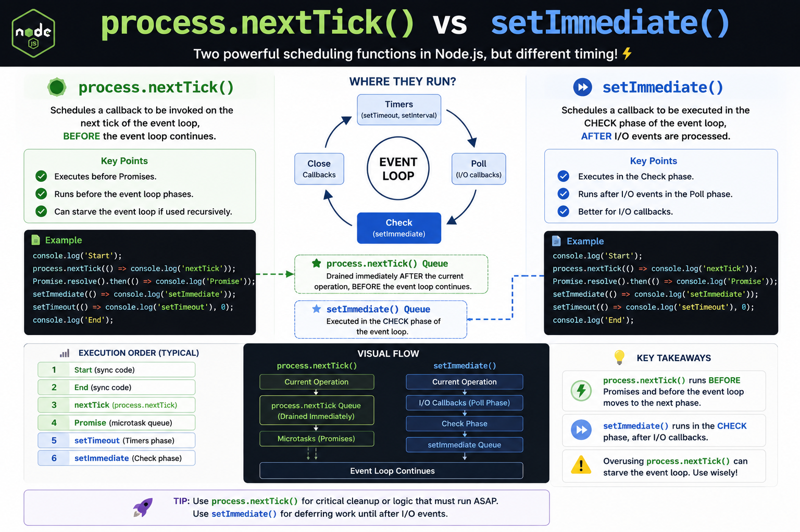

⚡ **`process.nextTick()` and `setImmediate()` may look similar, but they execute at different times in Node.js.**

Here's the difference:

🟢 **`process.nextTick()`**
• Runs **immediately after the current operation**
• Executes **before the Event Loop continues**
• Higher priority than Promises
• Great for urgent callbacks

🔵 **`setImmediate()`**
• Runs in the **Check** phase of the Event Loop
• Executes **after I/O callbacks**
• Ideal for deferring work until the current I/O cycle is complete

Example:

```js id="rj73mp"
console.log("Start");

process.nextTick(() => console.log("nextTick"));
Promise.resolve().then(() => console.log("Promise"));
setImmediate(() => console.log("Immediate"));

console.log("End");
```

Typical output:

```id="u9qm4n"
Start
End
nextTick
Promise
Immediate
```

💡 Rule of thumb:

* Use `process.nextTick()` for work that must happen **ASAP**.
* Use `setImmediate()` when you want to **yield to the Event Loop** before continuing.

#NodeJS #JavaScript #Backend #WebDevelopment #AsyncProgramming #Coding


